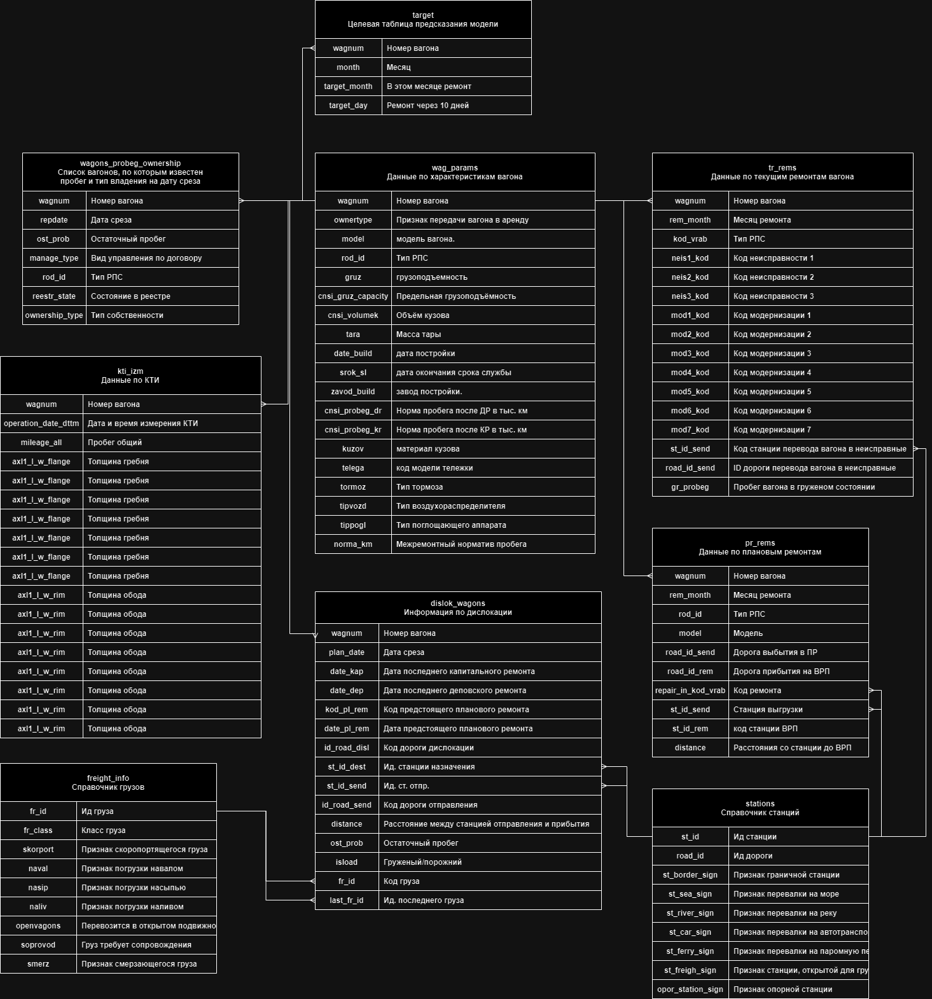

# Datawagon2

Прогнозирование отправления вагонов в ремонт от команды WagonWizards.

Исследование представлено в `jyputer` в формате форка `colab.research.google.com` с подключением локальной среды, для использования большего числа ресурсов.

Используемые (открытые) библиотеки перечислены в [`requirements.txt`](requirements.txt).

## Датасет

.

## Нейронная сеть

.

## Препроцессинг
### Таргеты
Процессинг таргетов: растягивание таргетов. Т.е. если вагон поломался, то обозначение всего месяца за 1, а не одного дня.
Аналогично для 10ти дневных таргетов. Метки сдвинули на 1 месяц назад для предсказания.
*замечание - неверная разметка 10тидневных таргетов лишь в начале месяца может привести к ошибкам в модели и неверному обучению, что вагоны ломаются только вначале месяца.
### Фичи
Объединение таблиц данных, генерация искусственных фичей. 
В итоговом DataFrame - 63 признака.
*заняло 90% времени*
### Сплит
Так как имеем дело с time-oriented data, то от cross-validation отказались.
Разделили датасет на train(данные до декабря примерно), val(декабрь, январь), test(февраль).

## Градиентный бустинг
Катбуст, n_estimators=500, shrink по best_score на валидиации автоматически. По внутренней eval во время обучения на отложенной выборке

## Постпроцессинг
Для месяца и 10ти дней отдельные модели, затем аггрегация (пробовал несколько методов - по max и mean [с донастройкой]) по датам для получения одного предикта по каждому номеру вагона.
Попробовал подобрать порог для аггрегации предсказаний по roc-методу.

## дополнительно
Сид зафиксирован, модели сохранены, решение воспроизводимо, все есть здесь в репозитории
